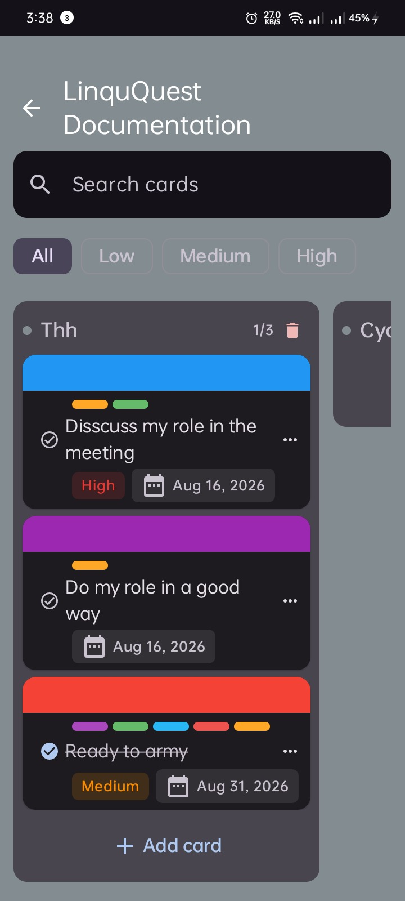
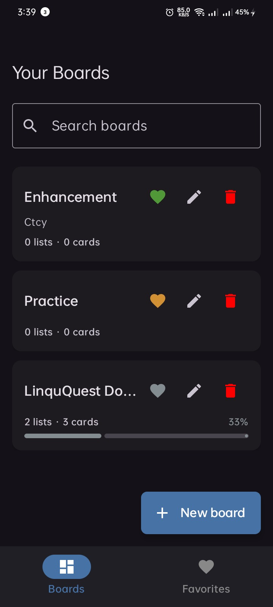
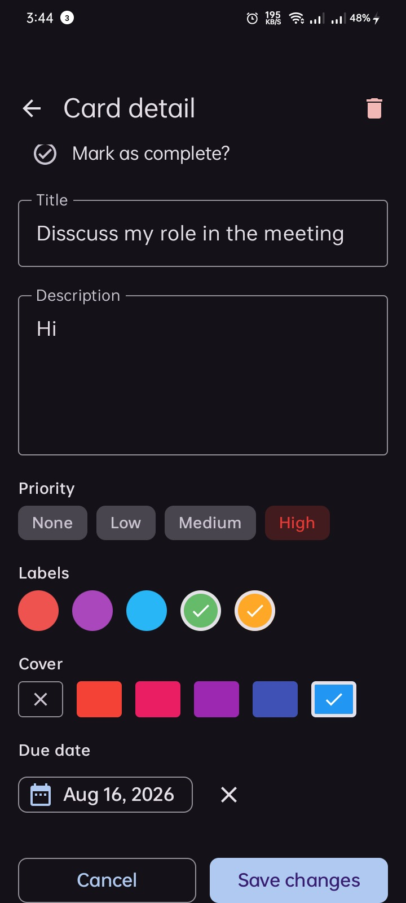

# Trello-Inspired Task Manager

A polished Android task-management application inspired by modern Kanban workflows, built with **Kotlin** and **Jetpack Compose**.

The project focuses on creating a fluid, intuitive board experience where users can organize their work using boards, lists, and cards — with advanced drag-and-drop interactions, smooth animations, rich card metadata, and an offline-first architecture.

> **This is an independent project inspired by the Kanban experience of applications such as Trello. It is not affiliated with or endorsed by Trello.**

---

## ✨ Highlights

The project goes beyond basic CRUD functionality and focuses heavily on **interaction design, architecture, and user experience**.

### 🖐️ Advanced Drag & Drop

* Drag cards between lists.
* Reorder cards within a list.
* Reorder entire lists horizontally.
* Automatically scroll the board when dragging near the screen edges.
* Smooth visual feedback throughout the interaction.

### 🎴 Rich Card Management

Cards support:

* Colored labels
* Cover headers
* Due dates
* Priority levels
* Completion status
* Swipe-to-delete interactions

### 🎨 Custom Board Experience

Each board can have its own visual identity through:

* Custom background colors
* Transparent top app bars
* Themed board content
* Dynamic visual styling

### ⭐ Favorites

Users can mark important boards as favorites and access them from a dedicated Favorites experience.

### 🎬 Smooth Animations

The UI uses Jetpack Compose's animation APIs to keep structural changes visually smooth.

For example, `animateItem()` is used when cards and lists are:

* Added
* Removed
* Reordered

The goal is to make state changes feel natural instead of abrupt.

### 🧱 Architecture

The application follows an **MVI (Model-View-Intent)** architecture to provide:

* Unidirectional data flow
* Predictable UI state
* Explicit user intents
* Clear separation between presentation and business logic
* Easier reasoning about complex UI interactions

---

## 📸 Screenshots

### Board View

The main board experience with horizontally organized lists and interactive cards.

### My Boards

A centralized view for browsing and managing boards.

### Card Details

A detailed card experience containing metadata such as labels, priority, due dates, and completion state.

| Board View                                                                           | My Boards                                                                                                                               | Card Details                                                                             |
|--------------------------------------------------------------------------------------| --------------------------------------------------------------------------------------------------------------------------------------- |------------------------------------------------------------------------------------------|
|  |  |  |

---

## 🛠️ Tech Stack

| Technology             | Purpose                                        |
| ---------------------- | ---------------------------------------------- |
| **Kotlin**             | Primary programming language                   |
| **Jetpack Compose**    | Declarative UI toolkit                         |
| **Material 3**         | Modern Android UI components and theming       |
| **MVI**                | Presentation architecture and state management |
| **Dagger Hilt**        | Dependency injection                           |
| **Room**               | Local database and persistence                 |
| **Navigation Compose** | Type-safe application navigation               |
| **Kotlin Coroutines**  | Asynchronous programming                       |
| **StateFlow**          | Reactive state management                      |

---

## 🏗️ Architecture

The project follows **MVI (Model-View-Intent)** with a layered architecture designed to keep UI, business logic, and data concerns separated.

The general data flow is:

```text
User Interaction
       ↓
     Intent
       ↓
   ViewModel
       ↓
    Use Case
       ↓
 Repository
       ↓
 Data Source
       ↓
    Room DB
```

State flows back toward the UI:

```text
Room / Repository
       ↓
    Use Case
       ↓
   ViewModel
       ↓
    UI State
       ↓
   Compose UI
```

This approach makes state transitions explicit and provides a predictable way to reason about complex interactions such as drag-and-drop, reordering, deletion, and board updates.

---

## 📂 Project Structure

The codebase is organized around clear architectural responsibilities and feature boundaries.

```text
app/
└── src/
    └── main/
        ├── java/
        │   └── ...
        │
        └── res/
            ├── drawable/
            ├── mipmap/
            └── values/
```

Within the application code, responsibilities are separated into areas such as:

```text
feature/
├── boards/
│   ├── data/
│   ├── domain/
│   └── presentation/
│
├── cards/
│   ├── data/
│   ├── domain/
│   └── presentation/
│
└── ...
```

The exact feature structure may evolve as the project grows, but the main principle is to keep **presentation, domain logic, and data access separated**.

---

## 🧠 Engineering Focus

This project was built with particular attention to problems that are more interesting than simple CRUD screens.

### Complex Gesture Handling

The board UI required coordinating:

* Horizontal scrolling
* Drag gestures
* Card reordering
* Cross-list movement
* List reordering
* Edge-triggered scrolling

These interactions require careful state management because multiple UI behaviors can be active during a single gesture.

### Predictable State Management

Rather than allowing UI components to directly manipulate application data, user actions are represented as explicit intents.

For example:

```text
User drags card
       ↓
MoveCard intent
       ↓
ViewModel
       ↓
Use Case
       ↓
Repository
       ↓
Updated state
       ↓
Compose recomposes
```

This keeps the source of truth centralized and makes complicated UI behavior easier to reason about.

### Offline-First Persistence

The application uses **Room** for local persistence, allowing the board data to remain available without relying on a network connection.

---

## 🚀 Getting Started

### Prerequisites

* Android Studio
* JDK 17+
* Android SDK
* An Android device or emulator

### Clone the Repository

```bash
git clone <repository-url>
cd <project-directory>
```

### Open the Project

Open the project with Android Studio and allow Gradle to synchronize the project dependencies.

### Run

Select an Android emulator or connected device and run the `app` configuration.

---

## 🗺️ Future Improvements

Possible future improvements include:

* [ ] Cloud synchronization
* [ ] User authentication
* [ ] Collaborative boards
* [ ] Real-time updates
* [ ] Board sharing
* [ ] Notifications and reminders
* [ ] Additional board customization
* [ ] Automated UI and unit testing

---

## 📚 What This Project Demonstrates

This project is intended to demonstrate practical experience with modern Android development, particularly:

* Building complex UIs with Jetpack Compose
* Designing unidirectional data flow with MVI
* Managing complex gesture-driven interactions
* Implementing drag-and-drop behavior
* Persisting application state with Room
* Structuring applications using clean architectural boundaries
* Using dependency injection with Hilt
* Managing asynchronous work with Coroutines and StateFlow
* Creating smooth and responsive UI animations

---

## 👨‍💻 Author

**Mohamed Ali Shaltout**

This project was built as an independent Android development project with a focus on modern architecture, UI/UX, and complex interaction design.

---

## 📄 License

Copyright (c) 2026 Mohamed Ali Shaltout. All rights reserved.

This repository is publicly available for viewing and educational/reference purposes.

No permission is granted to reproduce, distribute, modify, or use the source code for commercial purposes without explicit permission from the copyright holder.

Trello is a trademark of Atlassian. This project is an independent, Trello-inspired application and is not affiliated with or endorsed by Atlassian or Trello.
